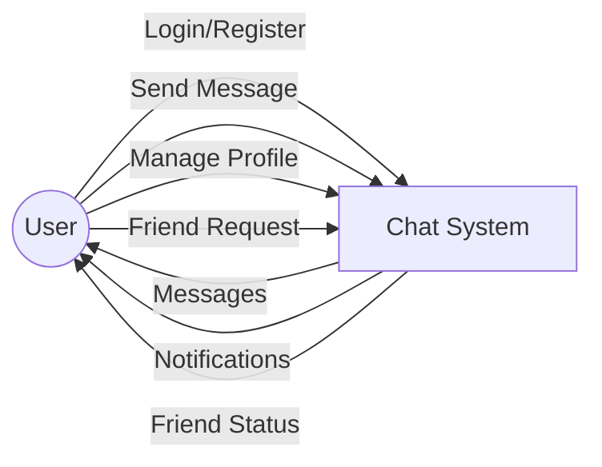
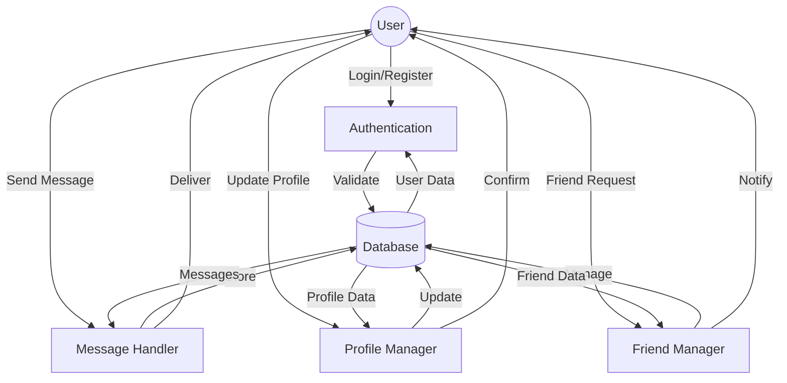
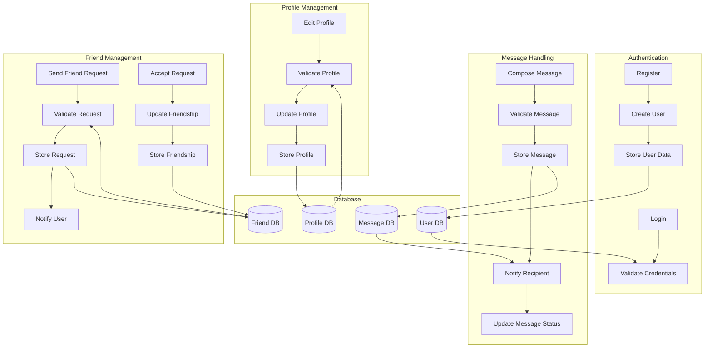

# Chat Application Data Flow Diagrams (DFD)

## Level 0 (Context Diagram)

## Level 1 (Top Level)

## Level 2 (Detailed Level)

## Process Descriptions

### Authentication Processes
1. **Login**
   - Input: Username/Email and Password
   - Process: Validate credentials against database
   - Output: Authentication token or error message

2. **Register**
   - Input: User details (username, email, password)
   - Process: Create new user account
   - Output: Success message or validation errors

### Message Handling Processes
1. **Compose Message**
   - Input: Message content and recipient
   - Process: Validate and format message
   - Output: Prepared message for sending

2. **Message Delivery**
   - Input: Prepared message
   - Process: Store and deliver to recipient
   - Output: Delivery confirmation

### Profile Management Processes
1. **Edit Profile**
   - Input: Updated profile information
   - Process: Validate and update profile
   - Output: Updated profile confirmation

### Friend Management Processes
1. **Friend Request**
   - Input: Friend request details
   - Process: Validate and store request
   - Output: Request notification

2. **Accept Request**
   - Input: Request acceptance
   - Process: Update friendship status
   - Output: Friendship confirmation

## Data Stores
1. **User Database**
   - Stores user credentials and basic information
   - Maintains user authentication data

2. **Message Database**
   - Stores all messages and their status
   - Maintains message history

3. **Profile Database**
   - Stores user profile information
   - Maintains profile updates

4. **Friend Database**
   - Stores friendship relationships
   - Maintains friend request status

## External Entities
1. **User**
   - Initiates all processes
   - Receives notifications and updates
   - Manages their profile and connections 